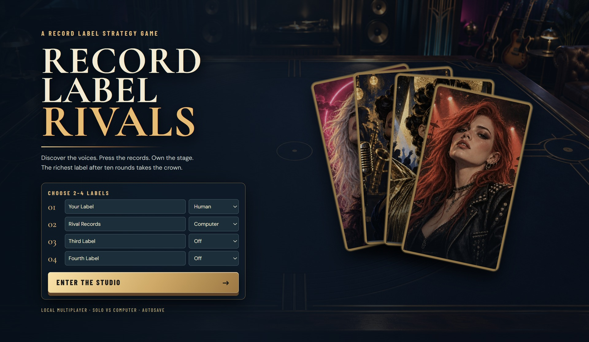
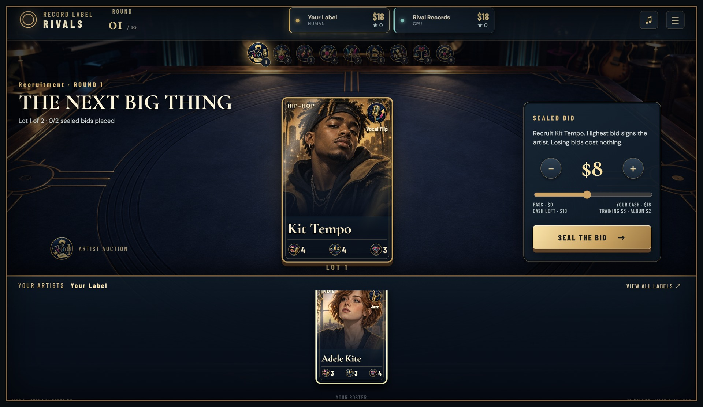
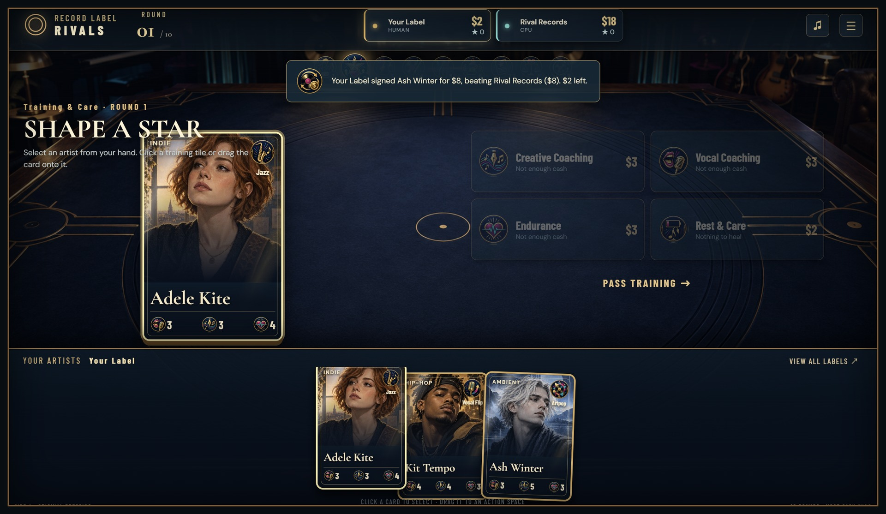
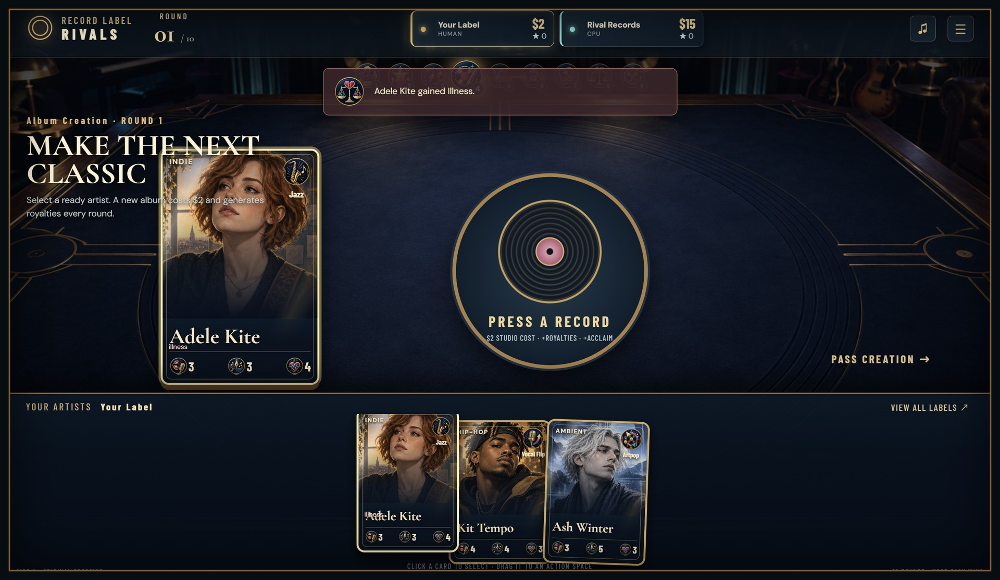
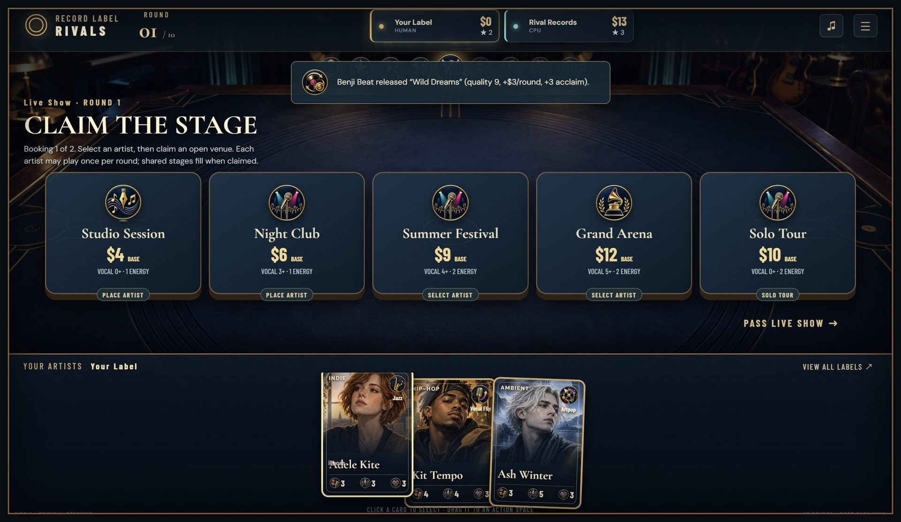
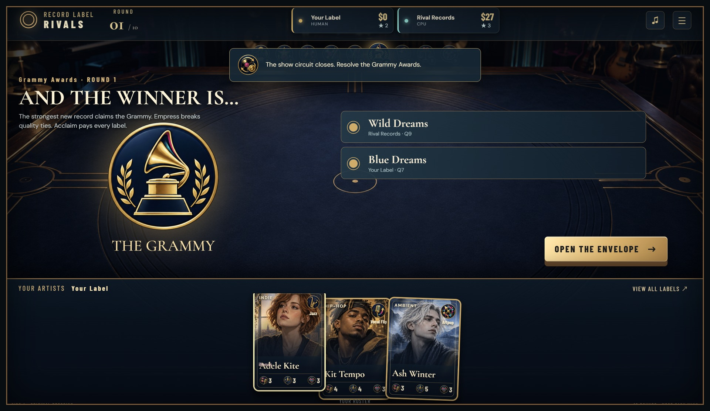
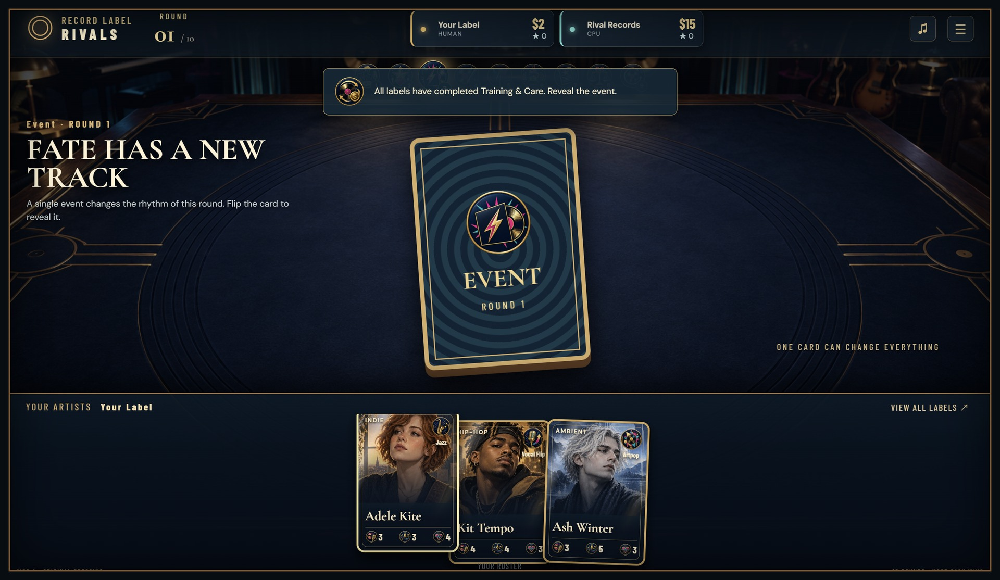
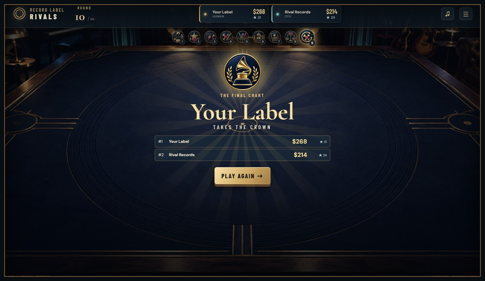
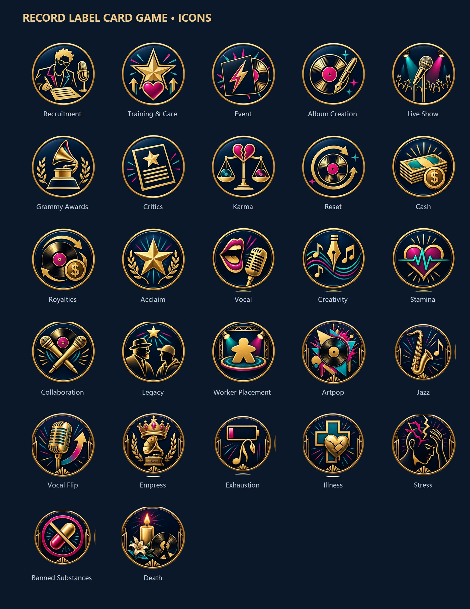
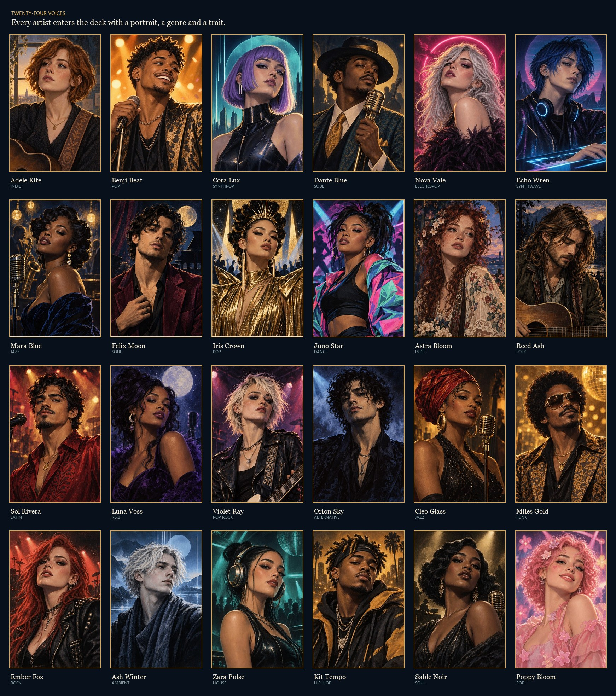

# Record Label Rivals

A playable, English-language record label strategy game for 2–4 labels. Play with friends on one device, or play solo against computer labels. No account or online service is required. Progress saves automatically.

**[⬇ Download the Windows build](https://github.com/NoahIsARider/ICONS/releases/latest)** — unzip it and run `RecordLabelRivals.exe`. No installer, no Node.js, nothing to compile.

## Screenshots

| The title screen | The artist auction |
| --- | --- |
|  |  |
| **Training & Care** | **Album creation** |
|  |  |
| **The live show board** | **The Grammy** |
|  |  |
| **The event card** | **The final chart** |
|  |  |

## Artwork

Every icon and portrait is generated for the game. The 27 icons are individual 512 × 512 transparent PNGs, also meant to be printed as physical tokens; each of the 24 artists has a portrait that doubles as their playing card.





## Strategy and balance

The rules take one game to learn, but the economics are not obvious — so both are written down
and measured rather than guessed at:

- **[docs/REFERENCE.md](docs/REFERENCE.md)** — every element explained with its exact numbers:
  what Vocal / Creativity / Stamina do, what each tag really changes, all venues, statuses and
  events, and a per-artist cheat sheet saying who is built for albums and who is built for shows.
- **[docs/STRATEGY.md](docs/STRATEGY.md)** — what actually wins: the three income loops, how much
  a computer can bid for a lot, and which habits are load-bearing.
- **[docs/BALANCE.md](docs/BALANCE.md)** — the audit behind it, including the one fairness flaw it
  turned up (the first seat wins about twice its fair share) and the verified fix.
- **[docs/DLC-ASSETS.md](docs/DLC-ASSETS.md)** — the two planned expansions (an acting-agency
  season and a group-debut stage season) and the complete artwork shopping list for them: every
  medallion, every portrait, every background, with the prompt for each sheet.

All three are reproducible: `node tools/strategy-lab.mjs all 400` replays every experiment against
the engine, so a rules change can be re-measured instead of argued about.

## Play

**Windows:** double-click `PLAY.cmd`. Keep its terminal window open while playing.

**Any system with Node.js 20+:** run `node server.mjs` in this folder, then visit `http://localhost:4173`.

The game has no package dependencies. The browser loads the local game files and icon artwork from the server.

## Desktop build (Windows)

`build-desktop.ps1` stages the game files into `desktop-app/`, and `pnpm run package:win` packs them into `dist/RecordLabelRivals-win32-x64/`. The executable serves the game on a loopback port inside its own window and writes the autosave to `%APPDATA%\Record Label Rivals\game-save.json` through a preload bridge, so progress survives even when browser storage is unavailable. A build is validated end to end with:

```
python tools/desktop-validate.py --exe dist/RecordLabelRivals-win32-x64/RecordLabelRivals.exe
```

That harness launches the executable against a throwaway profile, clicks through real turns over the DevTools protocol, and asserts the save channel: nothing on disk before the game starts, a rewritten save after every action, and a restored table after a reload.

## Goal and turn structure

The label with the most cash after **10 rounds** wins. Acclaim and release count break cash ties. Each round has nine phases:

1. **Recruitment:** two artists enter sealed-bid auctions. The highest bid signs each artist, and **only the winning bidder pays** — a losing bid costs nothing and stays secret until the auction resolves.
2. **Training & Care:** each label can improve an ability, recover an artist, or pass.
3. **Event:** reveal a card that changes the round.
4. **Album Creation:** each label can release one album. Quality sets acclaim and recurring royalties.
5. **Live Show:** each label gets two worker placements. Place different artists at shared venues or unlocked Solo Tours. Each shared venue can be claimed once; shows pay immediately.
6. **Grammy Awards:** the best new release wins. Acclaim also pays a cash benefit.
7. **Critics:** the label at the bottom of the acclaim track loses cash.
8. **Karma:** status effects may permanently reduce an artist's ability or cause death.
9. **Reset:** collect royalties, recover stamina, and begin the next round.

Artpop boosts album creation. Vocal Flip boosts shows. Jazz protects Vocal from Tobacco. Empress wins Grammy quality ties. Related artists can gain mentorship and release collaboration singles; a younger artist can inherit a creative spark if a mentor dies.

## Controls

Use the **I'M READY** screen when passing the device to another human player. Auction bids stay hidden until all labels submit. The right panel shows label standings and recent activity. The game autosaves after every action. **New Game** starts over after confirmation.

## Files

- `index.html`, `game-app.mjs`, `game.css`: playable interface.
- `engine.mjs`, `data.mjs`: rules and game content.
- `server.mjs`: local static server, also embedded inside the desktop build.
- `electron-main.cjs`, `electron-preload.cjs`: desktop shell and its save bridge.
- `test/game.test.mjs`: complete-game and rule tests; run with `node --test`.
- `tools/desktop-validate.py`: launches a packaged build and verifies the standalone save channel.
- `tools/strategy-lab.mjs`: the seeded-game experiments behind `docs/STRATEGY.md` and `docs/BALANCE.md`.
- `tools/capture-screenshots.py`, `tools/build-art-sheets.py`: regenerate the images in `screenshots/`.
- `docs/REFERENCE.md`, `docs/STRATEGY.md`, `docs/BALANCE.md`, `docs/DLC-ASSETS.md`: every element, what wins, fairness, and the expansion artwork list.
- `icons/`: 27 individual 512 × 512 transparent PNGs.
- `portraits/`, `assets/`: artist portraits and table artwork.
- `screenshots/`: the gallery above, captured from the packaged build.
- `icons-preview.png`: labeled icon contact sheet.
- `source/`, `portrait-source/`, `build_icons.ps1`, `build_portraits.ps1`, `PROMPTS.md`: original artwork sheets and build information.

For print, check a physical proof at the intended token size. The icons are raster illustrations, not vector files.
